#  Design Patterns

## 🚀 SOLID Principles

SOLID is an acronym for five design principles intended to make software designs more understandable, flexible, and maintainable. These principles are particularly useful in object-oriented programming.

### 1. **Single Responsibility Principle (SRP)**
**Definition**: A class should have only one reason to change, meaning it should have only one job or responsibility.

**Important Points**:
- Ensures that a class is focused on one task or feature.
- Reduces the risk of unintended side effects when changes are made.
- Enhances code readability and maintainability.

**Example**:
```java
// BAD example - violating SRP
class UserService {
    public void registerUser(User user) {
        // Register user
    }

    public void sendWelcomeEmail(User user) {
        // Send email
    }

    public void logUserRegistration(User user) {
        // Log registration
    }
}

// GOOD example - adhering to SRP
class UserService {
    public void registerUser(User user) {
        // Register user
    }
}

class EmailService {
    public void sendWelcomeEmail(User user) {
        // Send email
    }
}

class LoggingService {
    public void logUserRegistration(User user) {
        // Log registration
    }
}
```

### 2. **Open/Closed Principle (OCP)**
**Definition**: Software entities (classes, modules, functions, etc.) should be open for extension but closed for modification.

**Important Points**:
- New functionality can be added by extending existing code.
- Existing code remains unchanged, reducing the risk of introducing bugs.

**Example**:
```java
// BAD example - violating OCP
class Rectangle {
    public double length;
    public double width;
}

class AreaCalculator {
    public double calculateArea(Rectangle rectangle) {
        return rectangle.length * rectangle.width;
    }
}

// GOOD example - adhering to OCP
interface Shape {
    double calculateArea();
}

class Rectangle implements Shape {
    public double length;
    public double width;

    public double calculateArea() {
        return length * width;
    }
}

class Circle implements Shape {
    public double radius;

    public double calculateArea() {
        return Math.PI * radius * radius;
    }
}
```

### 3. **Liskov Substitution Principle (LSP)**
**Definition**: Objects of a superclass should be replaceable with objects of a subclass without affecting the correctness of the program.

**Important Points**:
- Subtypes must be substitutable for their base types.
- Promotes the use of polymorphism.

**Example**:
```java
// BAD example - violating LSP
class Bird {
    public void fly() {
        // Fly in the sky
    }
}

class Ostrich extends Bird {
    @Override
    public void fly() {
        throw new UnsupportedOperationException("Ostrich can't fly!");
    }
}

// GOOD example - adhering to LSP
interface Bird {
    void eat();
}

class FlyingBird implements Bird {
    public void fly() {
        // Fly in the sky
    }

    @Override
    public void eat() {
        // Eat food
    }
}

class Ostrich implements Bird {
    @Override
    public void eat() {
        // Eat food
    }
}
```

### 4. **Interface Segregation Principle (ISP)**
**Definition**: A client should not be forced to depend on interfaces it does not use.

**Important Points**:
- Promotes small, specific interfaces rather than large, monolithic ones.
- Reduces the impact of changes in the code.

**Example**:
```java
// BAD example - violating ISP
interface Worker {
    void work();
    void eat();
}

class HumanWorker implements Worker {
    public void work() {
        // Work
    }

    public void eat() {
        // Eat
    }
}

class RobotWorker implements Worker {
    public void work() {
        // Work
    }

    public void eat() {
        // Robots don't eat
    }
}

// GOOD example - adhering to ISP
interface Workable {
    void work();
}

interface Eatable {
    void eat();
}

class HumanWorker implements Workable, Eatable {
    public void work() {
        // Work
    }

    public void eat() {
        // Eat
    }
}

class RobotWorker implements Workable {
    public void work() {
        // Work
    }
}
```

### 5. **Dependency Inversion Principle (DIP)**
**Definition**: High-level modules should not depend on low-level modules. Both should depend on abstractions. Abstractions should not depend on details; details should depend on abstractions.

**Important Points**:
- Promotes loose coupling between classes.
- Enhances code flexibility and reusability.

**Example**:
```java
// BAD example - violating DIP
class LightBulb {
    public void turnOn() {
        // Turn on the light
    }

    public void turnOff() {
        // Turn off the light
    }
}

class Switch {
    private LightBulb lightBulb;

    public Switch(LightBulb lightBulb) {
        this.lightBulb = lightBulb;
    }

    public void operate() {
        lightBulb.turnOn();
    }
}

// GOOD example - adhering to DIP
interface Switchable {
    void turnOn();
    void turnOff();
}

class LightBulb implements Switchable {
    public void turnOn() {
        // Turn on the light
    }

    public void turnOff() {
        // Turn off the light
    }
}

class Switch {
    private Switchable device;

    public Switch(Switchable device) {
        this.device = device;
    }

    public void operate() {
        device.turnOn();
    }
}
```

## 🚀 Factory Design Pattern

### Purpose
- Factory design pattern is a creational design pattern that provides an interface for creating objects in a superclass, but allows subclasses to alter the type of objects that will be created. 
- Exposes a method for creating objects, allowing subclasses to control the actual creation process.

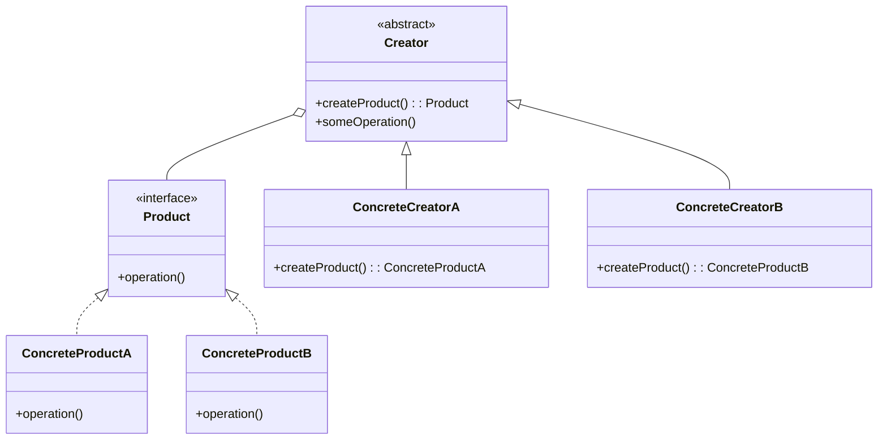

### Use when
- A class will not know what classes it will be required to create.
- Subclasses may specify what objects should be created. 
- Parent classes wish to defer creation to their subclasses.
- Useful for frequent code changes

### Example
Many applications have some form of user and group structure for security. When the application needs to create a user it will typically delegate the creation of the user to multiple user implementations. The parent user object will handle most operations for each user but the subclasses will define the factory method that handles the distinctions in the creation of each type of user. A system may have AdminUser and StandardUser objects each of which extend the User object. The AdminUser object may perform some extra tasks to ensure access while the StandardUser may do the same to limit access.


## 🚀 Abstract Factory Design Pattern

### Purpose
- Provide an interface that delegates creation calls to one or more concrete classes in order to deliver specific objects.

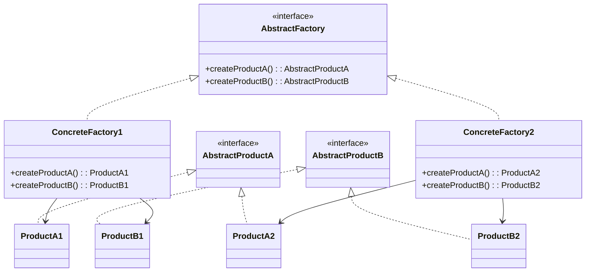

### Use when
- The creation of objects should be independent of the system utilizing them.
- Systems should be capable of using multiple families of objects.
- Families of objects must be used together.
- Libraries must be published without exposing implementation details.
- Concrete classes should be decoupled from clients.

### Example
Email editors allow for editing in multiple formats, including plain text, rich text, and HTML. Depending on the format, different objects are required: for plain text, a body object represents the text, and an attachment object encrypts attachments into Base64. For HTML, the body object represents HTML-encoded text, and the attachment object enables both inline representation and standard attachments. By using an abstract factory for creation, we ensure that the appropriate object sets are generated based on the email style being sent.


## 🚀 Singleton Design Pattern

### Purpose
- Singleton is a creational design pattern that lets you ensure that a class has only one instance, while providing a global access point to this instance.

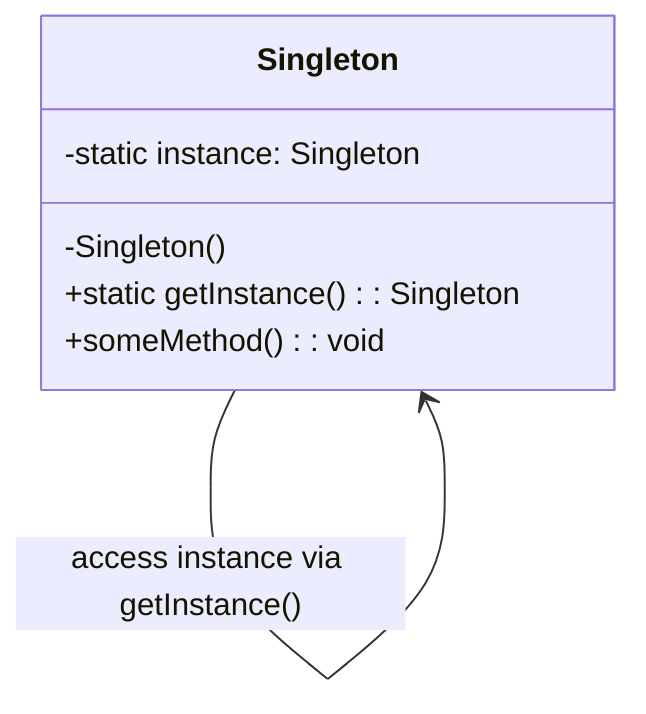

### Use when
- Exactly one instance of a class is required.
- Controlled access to a single object is necessary. 

### Example
Most languages provide some sort of system or environment object that allows the language to interact with the native operating system. Since the application is physically running on only one operating system there is only ever a need for a single instance of this system object. The singleton pattern would be implemented by the language runtime to ensure that only a single copy of the system object is created and to ensure only appropriate processes are allowed access to it. 

Database Connections: Only one instance of a connection should be used to manage interactions with the database.

Logging: A single instance of a logger can be used to ensure that all parts of an application log information to the same place.

Configuration Management: A single instance can manage the configuration settings of an application.


## 🚀 Prototype Design Pattern

### Purpose
- The Prototype Pattern is a creational design pattern used to create new objects by copying an existing object, known as the prototype. This pattern is particularly useful when the cost of creating a new object from scratch is more expensive than copying an existing object. It allows for the creation of new instances based on an existing instance, which can be more efficient.


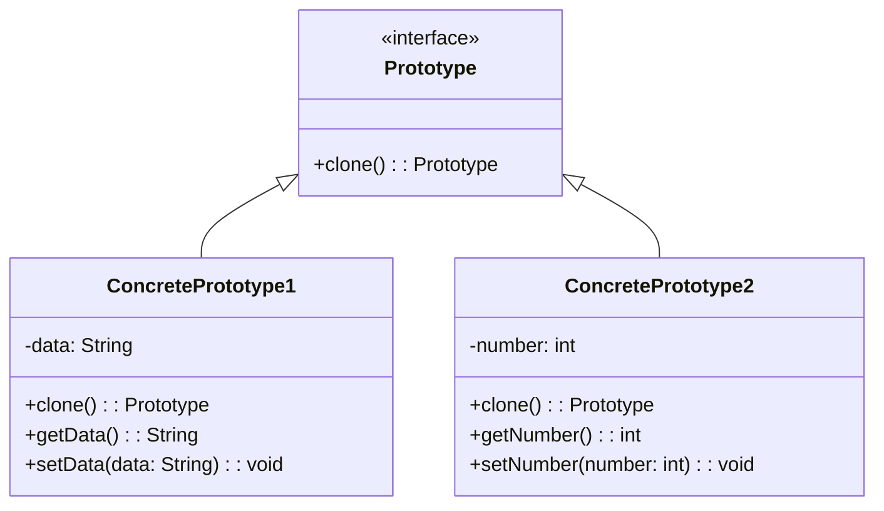

### Use when
- Creating complex objects with many attributes and dependencies can be expensive and time-consuming.
- Some objects might need to be configured or initialized in a certain way, and copying an existing object can be more straightforward than reconfiguring it from scratch.

### Example
Rates processing engines often require the lookup of many different configuration values, making the initialization of the engine a relatively expensive process. When multiple instances of the engine is needed, say for importing data in a multi-threaded manner, the expense of initializing many engines is high. By utilizing the prototype pattern we can ensure that only a single copy of the engine has to be initialized then simply clone the engine to create a duplicate of the already initialized object. The added benefit of this is that the clones can be streamlined to only include relevant data for their situation.


## 🚀 Builder Design Pattern

### Purpose
- The Builder Pattern is a creational design pattern used to construct complex objects step by step. It separates the construction of a complex object from its representation so that the same construction process can create different representations. This pattern is particularly useful when the object being created has multiple optional or required components, and you want to avoid a large number of constructors or factory methods.


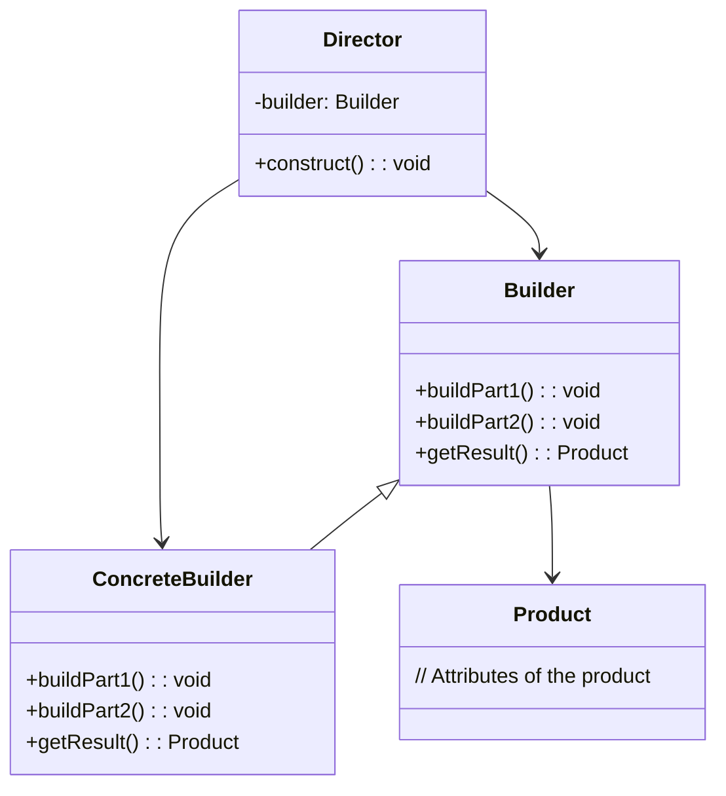

### Use when
- When creating an object involves many steps or configurations.
- To create immutable objects with optional parameters.
- To construct different representations of an object with the same construction process.
- The addition of new creation functionality without changing 
the core code is necessary.
- Runtime control over the creation process is required.

### Example
A file transfer application could possibly use many different protocols to send files and the actual transfer object that will be created will be directly dependent on the chosen protocol. Using a builder we can determine the right builder to use to instantiate the right object. If the setting is FTP then the FTP builder would be used when creating the object. 

## 🚀 Adapter Design Pattern

### Purpose
- The Adapter Pattern is a structural design pattern that allows incompatible interfaces to work together. It acts as a bridge between two objects, converting the interface of a class into another interface that a client expects. This pattern is particularly useful when integrating existing components that are incompatible with the rest of the system.


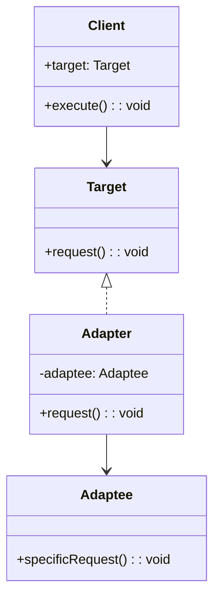

### Use when
- When you have existing classes or systems with interfaces that are not directly compatible with the interface your client code expects.
- When you need to integrate legacy systems or third-party libraries into your application.
- To reuse existing functionality without modifying the original code.

### Example
A billing application needs to interface with an HR application in order to exchange employee data, however each has its own interface and implementation for the Employee object. In addition, the SSN is stored in different formats by each system. By creating an adapter we can create a common interface between the two applications that allows them to communicate using their native objects and is able to transform the SSN format in the process.


## 🚀 Decorator Design Pattern

### Purpose
- The Decorator Pattern is a structural design pattern that allows you to dynamically add behavior or responsibilities to objects without modifying their code. It’s an alternative to subclassing, where new functionality is added by wrapping an object within another object. 
- It uses composition instead of inheritance.

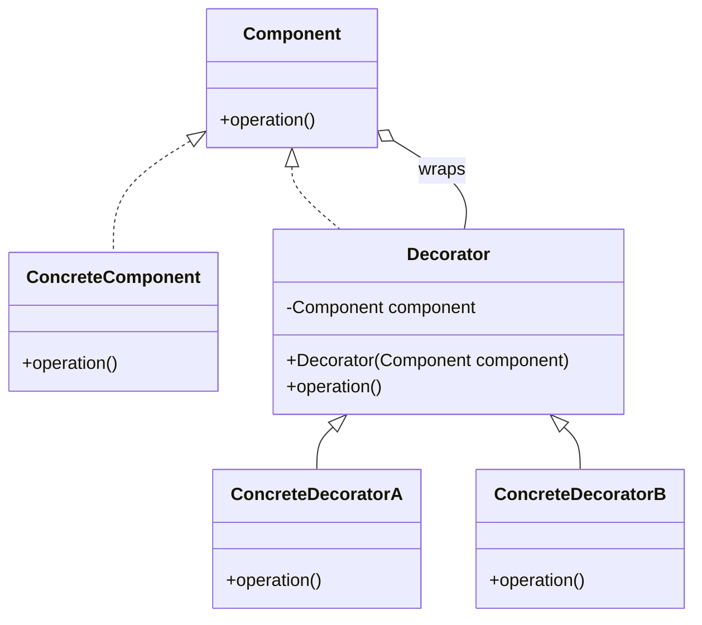

### Use when
- To extend the functionality of an object without altering its structure.
- To add functionalities to a class without altering its original code, keeping the class focused on its primary responsibility.
- To compose behaviors in a flexible and reusable way by chaining decorators.
- Subclassing to achieve modification is impractical or impossible.
- A lot of little objects surrounding a concrete implementation is acceptable.

### Example
Many businesses set up their mail systems to take advantage of decorators. When messages are sent from someone in the company to an external address the mail server decorates the original message with copyright and confidentiality information. As long as the message remains internal the information is not attached. This decoration allows the message itself to remain unchanged until a runtime decision is made to wrap the message with additional information.

## 🚀 Facade Design Pattern

### Purpose
- The Facade Pattern is a design pattern in software development that simplifies the interface for interacting with a complex system. 
- Think of it as a "front desk" for a hotel. When you visit a hotel, you don't directly interact with the cleaning staff, kitchen, or maintenance workers. Instead, you go to the front desk, and the front desk handles everything for you. The front desk is your simple, easy-to-use interface to the hotel.

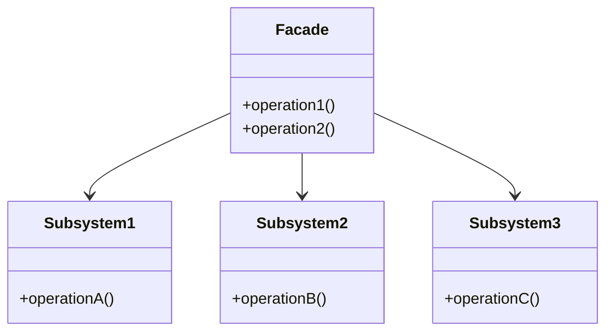

### Use when
- A simple interface is needed to provide access to a complex system.
- There are many dependencies between system implementations and clients.
- Systems and subsystems should be layered.

### Example
By exposing a set of functionalities through a web service 
the client code needs to only worry about the simple interface 
being exposed to them and not the complex relationships that 
may or may not exist behind the web service layer. A single 
web service call to update a system with new data may actually 
involve communication with a number of databases and systems, 
however this detail is hidden due to the implementation of the 
façade pattern.

## 🚀 Strategy Design Pattern

### Purpose
- Strategy is a behavioral design pattern that lets you define a family of algorithms, put each of them into a separate class, and make their objects interchangeable.

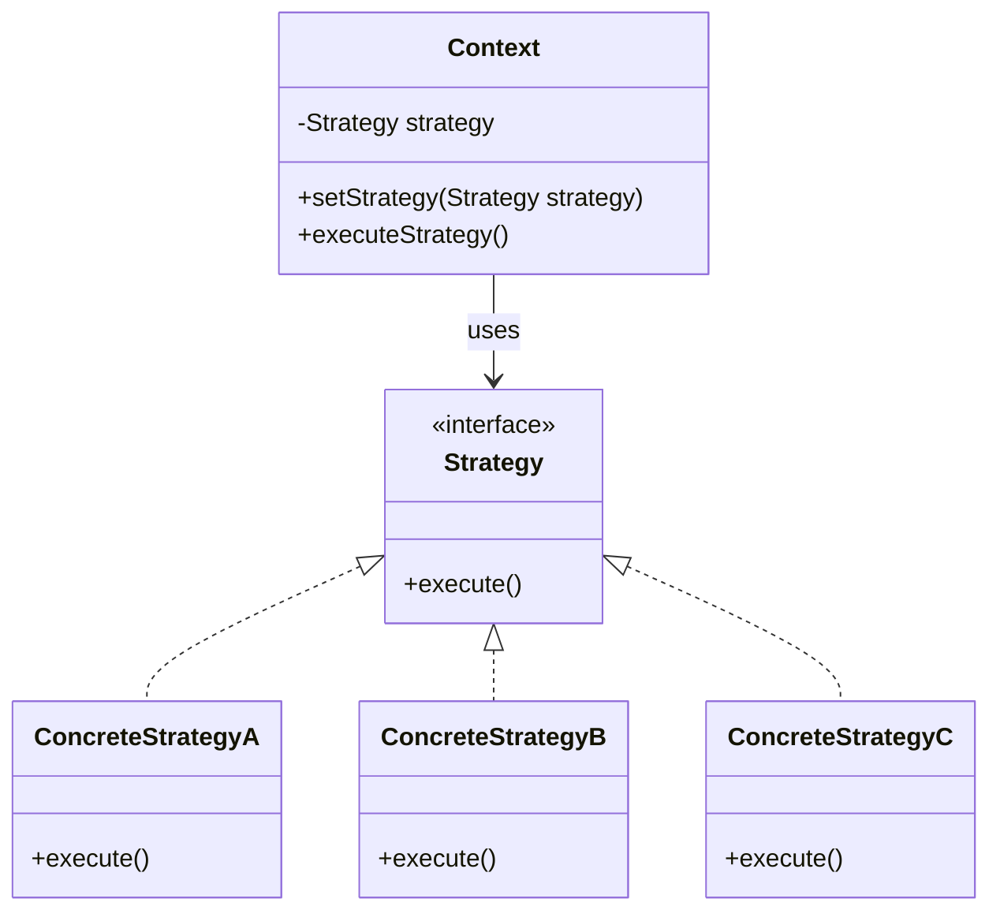

### Use when
- When you have multiple algorithms for a specific task, and you want to choose the algorithm at runtime.
- When you want to avoid using conditional statements (like if-else or switch-case) to select the appropriate algorithm.
- When you have a class that performs various functions that might change in the future.
- Algorithms access or utilize data that calling code shouldn’t be exposed to client.

### Example
- Sorting Algorithms: You might have different sorting strategies like bubble sort, merge sort, or quicksort, and you can choose the appropriate sorting strategy based on the context.
- Compression Algorithms: A file compression program might use different compression algorithms like ZIP, RAR, or TAR, chosen dynamically at runtime.


## 🚀 Observer Design Pattern

### Purpose
- The Observer Pattern is a behavioral design pattern that defines a one-to-many dependency between objects so that when one object changes state, all its dependents are notified and updated automatically. 
- This pattern is essential for creating systems where multiple objects need to be informed about changes in another object without tightly coupling them.

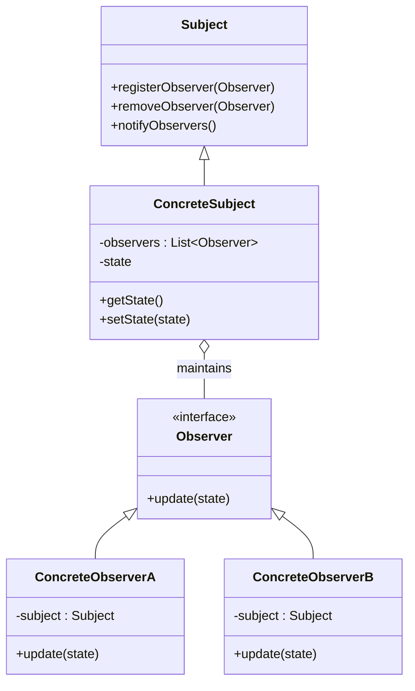

### Use when
- State changes in one or more objects should trigger behavior in other objects
- Broadcasting capabilities are required.
- An understanding exists that objects will be blind to the expense of notification.

### Example
- Event Handling Systems: When an object needs to notify other objects without making assumptions about who these objects are.
- Distributed Event Systems: When changes in one part of an application need to be propagated to other parts.
- This pattern can be found in almost every GUI environment. When buttons, text, and other fields are placed in applications the application typically registers as a listener for those controls. When a user triggers an event, such as clicking a button, the control iterates through its registered observers and sends a notification to each.


## 🚀 State Design Pattern

### Purpose
- Ties object circumstances to its behavior, allowing the object to behave in different ways based upon its internal state. 

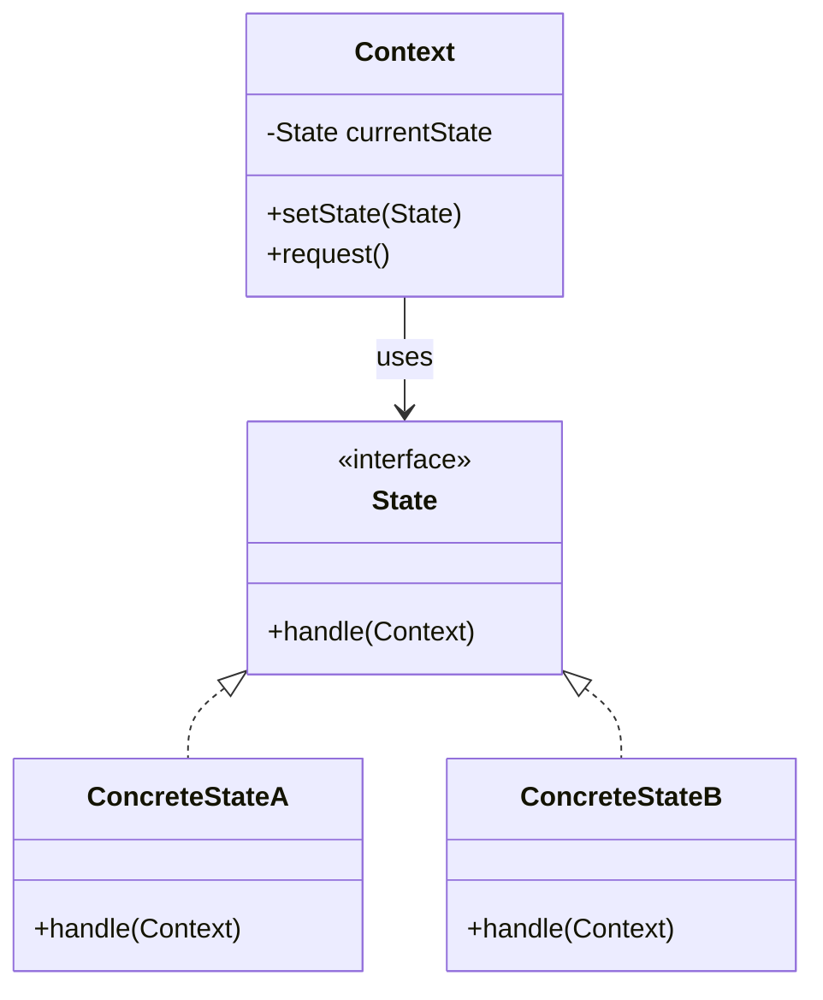

### Use when
- The behavior of an object should be influenced by its state.
- Complex conditions tie object behavior to its state.
- Transitions between states need to be explicit.

### Example
An email object can have various states, all of which will change how the object handles different functions. If the state is “not sent” then the call to send() is going to send the message while a call to recallMessage() will either throw an error or do nothing. However, if the state is “sent” then the call to send() would either throw an error or do nothing while the call to recallMessage() would attempt to send a recall notification to recipients. To avoid conditional statements in most or all methods there would be multiple state objects that handle the implementation with respect to their particular state. The calls within the Email object would then be delegated down to the appropriate state object for handling


## 🚀 Mediator Design Pattern

### Purpose
- The Mediator Pattern is a behavioral design pattern that helps reduce the complexity of communication between multiple objects or components. It does this by introducing a mediator object that handles all interactions between the different objects, so they don't have to communicate with each other directly.

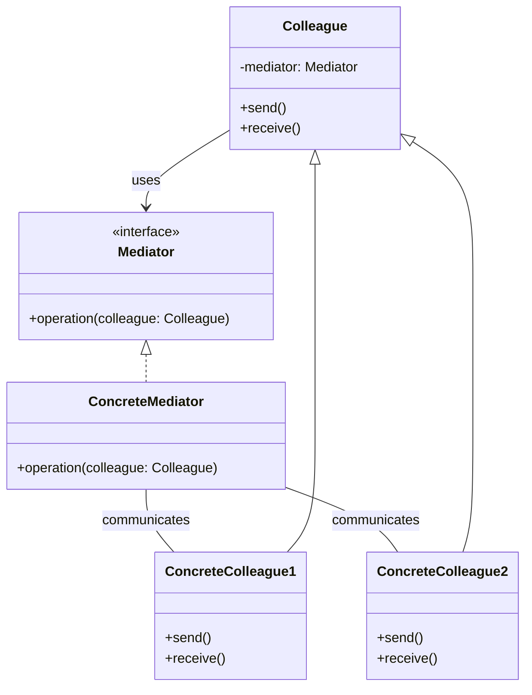

### Use when
- Without a mediator, each object would need to know about and communicate with every other object. This can get complex and hard to manage as the number of objects grows.
- Objects (colleagues) need to be decoupled from one another, meaning they don’t need to be aware of each other. They only interact with the mediator, making the system easier to maintain and extend.

### Example
Mailing list software keeps track of who is signed up to the mailing list and provides a single point of access through which any one person can communicate with the entire list. Without a mediator implementation a person wanting to send a message tothe group would have to constantly keep track of who was signed up and who was not. By implementing the mediator pattern the system is able to receive messages from any point then determine which recipients to forward the message on to, without the sender of the message having to be concerned with the actual recipient list.

## 🚀 Chain of Responsibility Design Pattern

### Purpose
- The Chain of Responsibility Pattern allows passing a request along a chain of handlers. Each handler in the chain either processes the request or passes it along to the next handler. It decouples the sender of a request from its receivers by allowing multiple objects to handle the request.

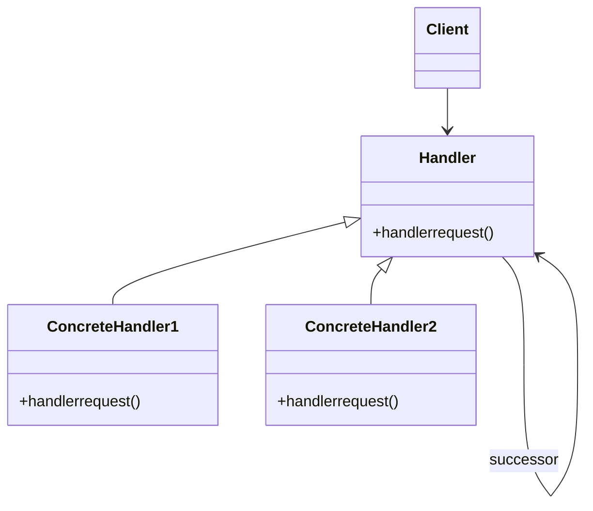

### Use when
- You have a set of handlers where each handler can process a request or pass it to the next handler in the chain.
- You want to avoid coupling the sender of a request to its receiver.
- You want to add or change handlers dynamically.

### Example
Exception handling in some languages implements this pattern. When an exception is thrown in a method the runtime checks to see if the method has a mechanism to handle the exception or if it should be passed up the call stack. When passed up the call stack the process repeats until code to handle the exception is encountered or until there are no more parent objects to hand the request to.