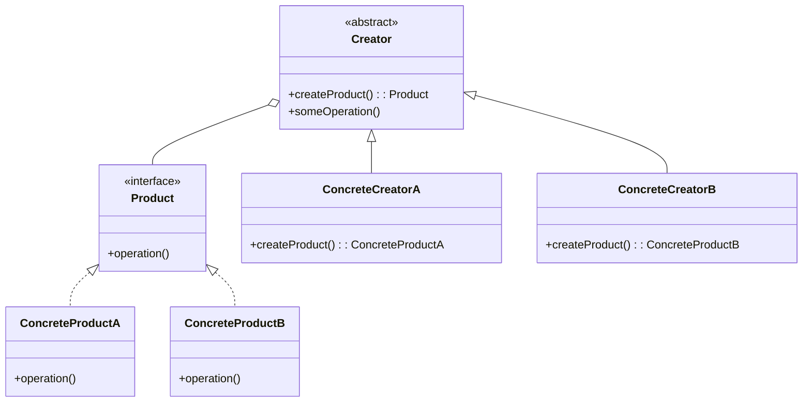
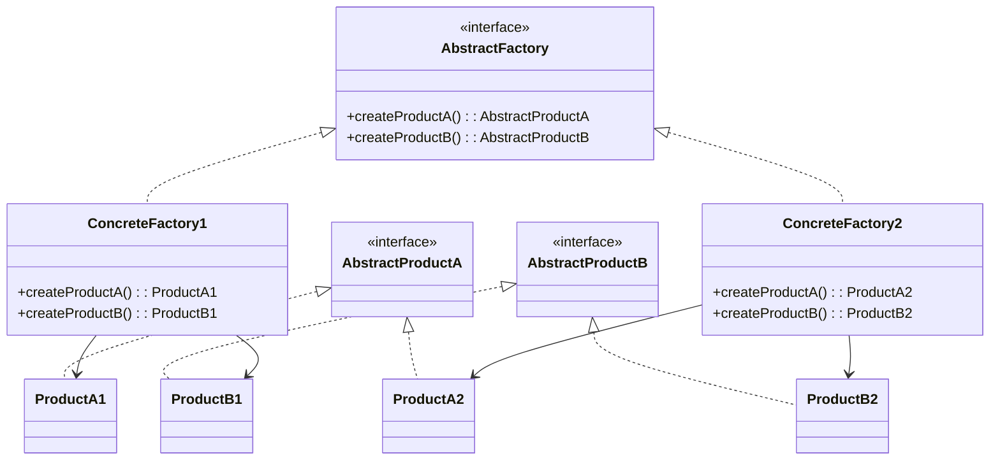
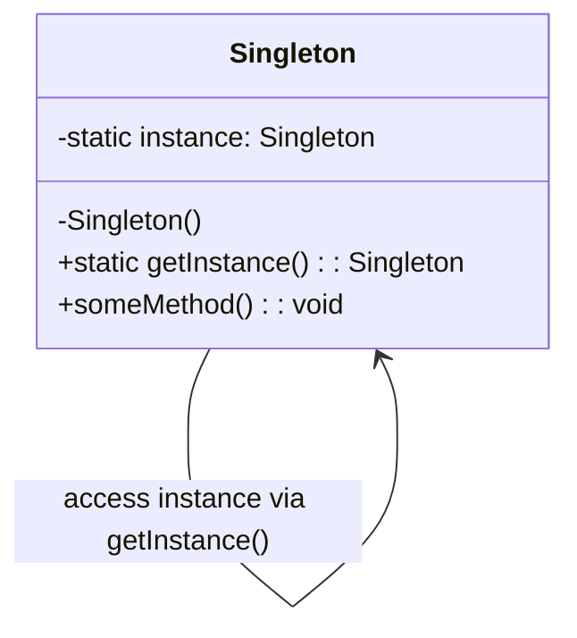
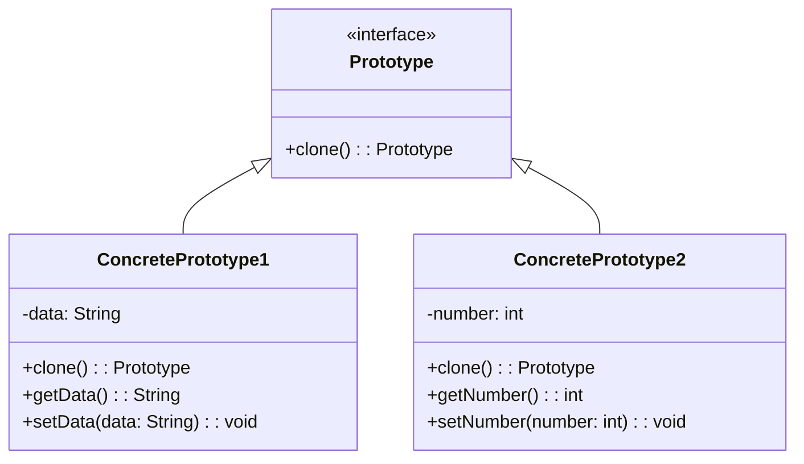
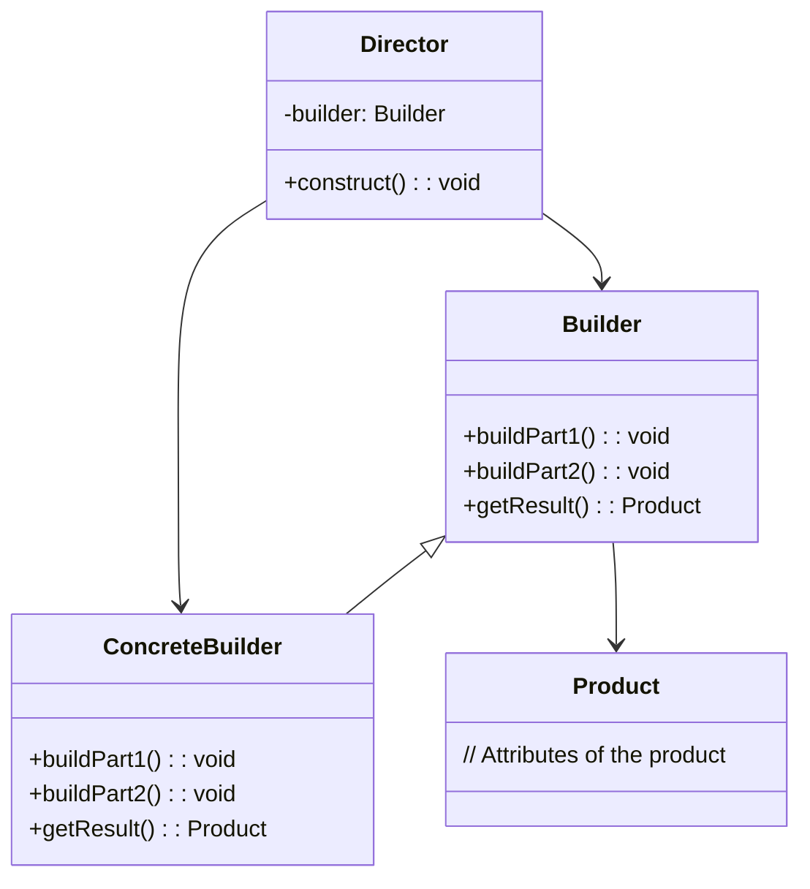
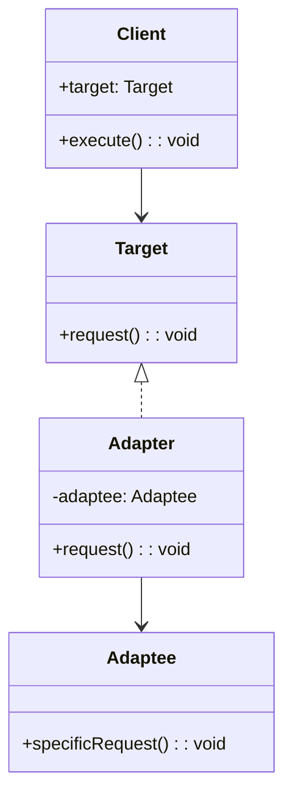
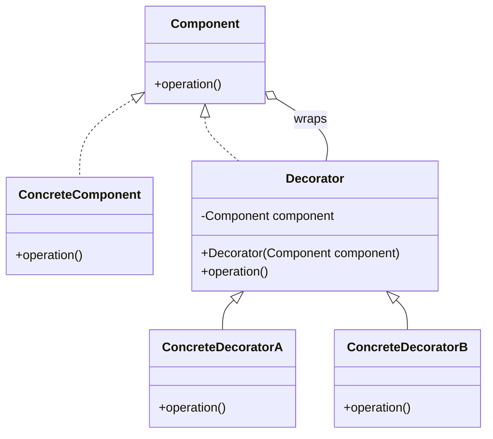

#  Design Patterns

## 🚀 Factory Design Pattern

### Purpose
- Factory design pattern is a creational design pattern that provides an interface for creating objects in a superclass, but allows subclasses to alter the type of objects that will be created. 
- Exposes a method for creating objects, allowing subclasses to control the actual creation process.

### Use when
- A class will not know what classes it will be required to create.
- Subclasses may specify what objects should be created. 
- Parent classes wish to defer creation to their subclasses.
- Useful for frequent code changes

### Example
Many applications have some form of user and group structure for security. When the application needs to create a user it will typically delegate the creation of the user to multiple user implementations. The parent user object will handle most operations for each user but the subclasses will define the factory method that handles the distinctions in the creation of each type of user. A system may have AdminUser and StandardUser objects each of which extend the User object. The AdminUser object may perform some extra tasks to ensure access while the StandardUser may do the same to limit access.

## 🚀 Abstract Factory Design Pattern

### Purpose
- Provide an interface that delegates creation calls to one or more concrete classes in order to deliver specific objects.

### Use when
- The creation of objects should be independent of the system utilizing them.
- Systems should be capable of using multiple families of objects.
- Families of objects must be used together.
- Libraries must be published without exposing implementation details.
- Concrete classes should be decoupled from clients.

### Example
Email editors allow for editing in multiple formats, including plain text, rich text, and HTML. Depending on the format, different objects are required: for plain text, a body object represents the text, and an attachment object encrypts attachments into Base64. For HTML, the body object represents HTML-encoded text, and the attachment object enables both inline representation and standard attachments. By using an abstract factory for creation, we ensure that the appropriate object sets are generated based on the email style being sent.

## 🚀 Singleton Design Pattern

### Purpose
- Singleton is a creational design pattern that lets you ensure that a class has only one instance, while providing a global access point to this instance.

### Use when
- Exactly one instance of a class is required.
- Controlled access to a single object is necessary. 

### Example
Most languages provide some sort of system or environment object that allows the language to interact with the native operating system. Since the application is physically running on only one operating system there is only ever a need for a single instance of this system object. The singleton pattern would be implemented by the language runtime to ensure that only a single copy of the system object is created and to ensure only appropriate processes are allowed access to it. 

Database Connections: Only one instance of a connection should be used to manage interactions with the database.

Logging: A single instance of a logger can be used to ensure that all parts of an application log information to the same place.

Configuration Management: A single instance can manage the configuration settings of an application.

## 🚀 Prototype Design Pattern

### Purpose
- The Prototype Pattern is a creational design pattern used to create new objects by copying an existing object, known as the prototype. This pattern is particularly useful when the cost of creating a new object from scratch is more expensive than copying an existing object. It allows for the creation of new instances based on an existing instance, which can be more efficient.

### Use when
- Creating complex objects with many attributes and dependencies can be expensive and time-consuming.
- Some objects might need to be configured or initialized in a certain way, and copying an existing object can be more straightforward than reconfiguring it from scratch.

### Example
Rates processing engines often require the lookup of many different configuration values, making the initialization of the engine a relatively expensive process. When multiple instances of the engine is needed, say for importing data in a multi-threaded manner, the expense of initializing many engines is high. By utilizing the prototype pattern we can ensure that only a single copy of the engine has to be initialized then simply clone the engine to create a duplicate of the already initialized object. The added benefit of this is that the clones can be streamlined to only include relevant data for their situation.

## 🚀 Builder Design Pattern

### Purpose
- The Builder Pattern is a creational design pattern used to construct complex objects step by step. It separates the construction of a complex object from its representation so that the same construction process can create different representations. This pattern is particularly useful when the object being created has multiple optional or required components, and you want to avoid a large number of constructors or factory methods.

### Use when
- When creating an object involves many steps or configurations.
- To create immutable objects with optional parameters.
- To construct different representations of an object with the same construction process.
- The addition of new creation functionality without changing 
the core code is necessary.
- Runtime control over the creation process is required.

### Example
A file transfer application could possibly use many different protocols to send files and the actual transfer object that will be created will be directly dependent on the chosen protocol. Using a builder we can determine the right builder to use to instantiate the right object. If the setting is FTP then the FTP builder would be used when creating the object. 

## 🚀 Adapter Design Pattern

### Purpose
- The Adapter Pattern is a structural design pattern that allows incompatible interfaces to work together. It acts as a bridge between two objects, converting the interface of a class into another interface that a client expects. This pattern is particularly useful when integrating existing components that are incompatible with the rest of the system.

### Use when
- When you have existing classes or systems with interfaces that are not directly compatible with the interface your client code expects.
- When you need to integrate legacy systems or third-party libraries into your application.
- To reuse existing functionality without modifying the original code.

### Example
A billing application needs to interface with an HR application in order to exchange employee data, however each has its own interface and implementation for the Employee object. In addition, the SSN is stored in different formats by each system. By creating an adapter we can create a common interface between the two applications that allows them to communicate using their native objects and is able to transform the SSN format in the process.

## 🚀 Decorator Design Pattern

### Purpose
- The Decorator Pattern is a structural design pattern that allows you to dynamically add behavior or responsibilities to objects without modifying their code. It’s an alternative to subclassing, where new functionality is added by wrapping an object within another object. 
- It uses composition instead of inheritance.

### Use when
- To extend the functionality of an object without altering its structure.
- To add functionalities to a class without altering its original code, keeping the class focused on its primary responsibility.
- To compose behaviors in a flexible and reusable way by chaining decorators.
- Subclassing to achieve modification is impractical or impossible.
- A lot of little objects surrounding a concrete implementation is acceptable.

### Example
Many businesses set up their mail systems to take advantage of decorators. When messages are sent from someone in the company to an external address the mail server decorates the original message with copyright and confidentiality information. As long as the message remains internal the information is not attached. This decoration allows the message itself to remain unchanged until a runtime decision is made to wrap the message with additional information.
