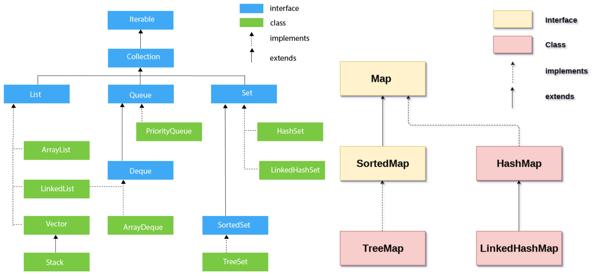
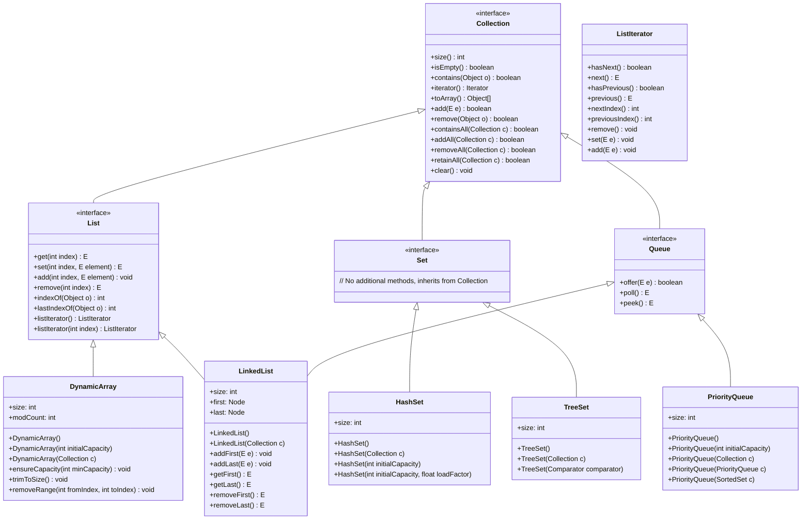
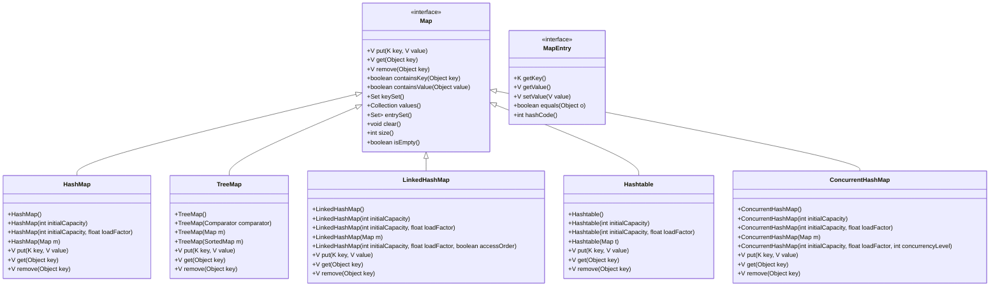

# Java Collection Framework



## Introduction

The Java Collection Framework (JCF) provides a unified architecture for representing and manipulating collections. A collection is a group of objects, known as elements. The framework provides interfaces and classes to help in storing, retrieving, and manipulating collections efficiently.

### UML diagram of Collection Interface


### UML diagram of Map Interface

## Key Interfaces

### 1. **Collection Interface**
- **Description:** The root interface of the Collection hierarchy.
- **Key Methods:**
    - `boolean add(E e)`
    - `boolean remove(Object o)`
    - `boolean contains(Object o)`
    - `int size()`
    - `Iterator<E> iterator()`
    - `boolean isEmpty()`
    - `boolean addAll(Collection<? extends E> c)`
    - `void clear()`

### 2. **List Interface**
- **Description:** Represents an ordered collection (also known as a sequence). Lists can contain duplicate elements.
- **Key Implementations:**
    - `DynamicArray`
    - `LinkedList`
    - `Vector`
    - `Stack`
- **Key Methods:**
    - `E get(int index)`
    - `E set(int index, E element)`
    - `void add(int index, E element)`
    - `E remove(int index)`
    - `int indexOf(Object o)`
    - `int lastIndexOf(Object o)`

### 3. **Set Interface**
- **Description:** Represents a collection that contains no duplicate elements.
- **Key Implementations:**
    - `HashSet`
    - `LinkedHashSet`
    - `TreeSet`
- **Key Methods:**
    - `boolean add(E e)`
    - `boolean remove(Object o)`
    - `boolean contains(Object o)`

### 4. **Queue Interface**
- **Description:** Represents a collection used to hold multiple elements prior to processing, typically in a FIFO (First-In-First-Out) manner.
- **Key Implementations:**
    - `PriorityQueue`
    - `LinkedList` (implements both `List` and `Queue`)
- **Key Methods:**
    - `boolean offer(E e)`
    - `E poll()`
    - `E peek()`

### 5. **Map Interface**
- **Description:** Represents a collection of key-value pairs, where each key is mapped to a single value. Maps cannot contain duplicate keys.
- **Key Implementations:**
    - `HashMap`
    - `TreeMap`
    - `LinkedHashMap`
    - `Hashtable`
    - `ConcurrentHashMap`
- **Key Methods:**
    - `V put(K key, V value)`
    - `V get(Object key)`
    - `V remove(Object key)`
    - `boolean containsKey(Object key)`
    - `boolean containsValue(Object value)`
    - `Set<K> keySet()`
    - `Collection<V> values()`
    - `Set<Map.Entry<K,V>> entrySet()`

## Collection Implementations

## 1. `DynamicArray`
- **Description:** A resizable array implementation of the `List` interface.
- **Characteristics:**
  - Allows random access via index.
  - Fast iteration and random access.
  - Slower insertion/removal operations compared to `LinkedList`.
- **Constructors:**
  - `DynamicArray()`
  - `DynamicArray(int initialCapacity)`
  - `DynamicArray(Collection<? extends E> c)`
- **Use When:** You need a dynamic array that supports efficient random access.
- **Why:** Provides fast read operations and better cache locality.

## 2. `LinkedList`
- **Description:** A doubly-linked list implementation of the `List` and `Deque` interfaces.
- **Characteristics:**
  - Efficient insertions and deletions at both ends.
  - No efficient random access.
  - Supports queue and stack operations.
- **Constructors:**
  - `LinkedList()`
  - `LinkedList(Collection<? extends E> c)`
- **Use When:** You need a list with frequent insertions and deletions.
- **Why:** Better performance for adding/removing elements compared to `DynamicArray`.

## 3. `Vector`
- **Description:** A synchronized resizable array implementation of the `List` interface.
- **Characteristics:**
  - Thread-safe due to synchronized methods.
  - Generally slower than `DynamicArray` due to synchronization.
- **Constructors:**
  - `Vector()`
  - `Vector(int initialCapacity)`
  - `Vector(int initialCapacity, int capacityIncrement)`
  - `Vector(Collection<? extends E> c)`
- **Use When:** You need a thread-safe dynamic array.
- **Why:** Provides synchronized methods, but `DynamicArray` with explicit synchronization is preferred.

## 4. `Stack`
- **Description:** A last-in, first-out (LIFO) stack implementation of the `List` interface.
- **Characteristics:**
  - Provides stack-specific operations like `push`, `pop`, and `peek`.
  - Extends `Vector`, meaning it is synchronized and thread-safe.
  - Not as efficient as `ArrayDeque` for stack operations due to synchronization overhead.
- **Constructors:**
  - `Stack()`
- **Methods:**
  - `E push(E item)`
  - `E pop()`
  - `E peek()`
  - `boolean empty()`
  - `int search(Object o)`
- **Use When:** You need a stack data structure with thread safety and stack-specific operations.
- **Why:** Provides LIFO behavior and thread safety.

## 5. `HashSet`
- **Description:** A set implementation that uses a hash table for storage.
- **Characteristics:**
  - No duplicate elements.
  - No guaranteed order of elements.
  - Fast performance for basic operations due to hashing.
- **Constructors:**
  - `HashSet()`
  - `HashSet(int initialCapacity)`
  - `HashSet(int initialCapacity, float loadFactor)`
  - `HashSet(Collection<? extends E> c)`
- **Use When:** You need a set with fast operations and no ordering.
- **Why:** Provides constant-time performance for basic operations.

## 6. `LinkedHashSet`
- **Description:** A set implementation that maintains insertion order using a linked list.
- **Characteristics:**
  - No duplicate elements.
  - Elements are iterated in the order they were added.
  - Provides predictable iteration order.
- **Constructors:**
  - `LinkedHashSet()`
  - `LinkedHashSet(int initialCapacity)`
  - `LinkedHashSet(int initialCapacity, float loadFactor)`
  - `LinkedHashSet(Collection<? extends E> c)`
- **Use When:** You need a set with predictable iteration order.
- **Why:** Maintains insertion order while providing fast access and update operations.

## 7. `TreeSet`
- **Description:** A set implementation that maintains elements in a sorted order using a red-black tree.
- **Characteristics:**
  - No duplicate elements.
  - Sorted elements based on natural ordering or a comparator.
  - Log(n) time complexity for basic operations.
- **Constructors:**
  - `TreeSet()`
  - `TreeSet(Comparator<? super E> comparator)`
  - `TreeSet(SortedSet<E> s)`
  - `TreeSet(Collection<? extends E> c)`
- **Use When:** You need a sorted set with log(n) time complexity for basic operations.
- **Why:** Automatically sorts elements and supports range view operations.

## 8. `HashMap`
- **Description:** A map implementation that uses a hash table for storage.
- **Characteristics:**
  - Key-value pairs with no guaranteed order.
  - Fast performance for basic operations due to hashing.
- **Constructors:**
  - `HashMap()`
  - `HashMap(int initialCapacity)`
  - `HashMap(int initialCapacity, float loadFactor)`
  - `HashMap(Map<? extends K, ? extends V> m)`
- **Use When:** You need a map with fast key-value operations and no ordering.
- **Why:** Provides constant-time performance for basic operations.

## 9. `LinkedHashMap`
- **Description:** A map implementation that maintains insertion order or access order using a linked list.
- **Characteristics:**
  - Key-value pairs with predictable iteration order.
  - Can maintain insertion order or access order (if specified).
- **Constructors:**
  - `LinkedHashMap()`
  - `LinkedHashMap(int initialCapacity)`
  - `LinkedHashMap(int initialCapacity, float loadFactor)`
  - `LinkedHashMap(Map<? extends K, ? extends V> m)`
  - `LinkedHashMap(int initialCapacity, float loadFactor, boolean accessOrder)`
- **Use When:** You need a map with predictable iteration order and optional access order.
- **Why:** Combines fast access with predictable ordering.

## 10. `TreeMap`
- **Description:** A map implementation that maintains keys in a sorted order using a red-black tree.
- **Characteristics:**
  - Key-value pairs with keys sorted according to natural ordering or a comparator.
  - Log(n) time complexity for basic operations.
- **Constructors:**
  - `TreeMap()`
  - `TreeMap(Comparator<? super K> comparator)`
  - `TreeMap(SortedMap<K, ? extends V> m)`
  - `TreeMap(Map<? extends K, ? extends V> m)`
- **Use When:** You need a map with sorted keys and log(n) time complexity for basic operations.
- **Why:** Automatically sorts keys and supports range view operations.

## 11. `Hashtable`
- **Description:** A synchronized map implementation that uses a hash table for storage.
- **Characteristics:**
  - Key-value pairs with no guaranteed order.
  - Synchronized for thread safety, but generally considered obsolete.
- **Constructors:**
  - `Hashtable()`
  - `Hashtable(int initialCapacity)`
  - `Hashtable(int initialCapacity, float loadFactor)`
  - `Hashtable(Map<? extends K, ? extends V> t)`
- **Use When:** You need a thread-safe map implementation (though `ConcurrentHashMap` is preferred).
- **Why:** Provides thread safety but with synchronization overhead.

## 12. `ConcurrentHashMap`
- **Description:** A thread-safe map implementation that allows concurrent access.
- **Characteristics:**
  - Key-value pairs with no guaranteed order.
  - Supports high concurrency with better performance than `Hashtable`.
  - Allows concurrent read and write operations.
- **Constructors:**
  - `ConcurrentHashMap()`
  - `ConcurrentHashMap(int initialCapacity)`
  - `ConcurrentHashMap(int initialCapacity, float loadFactor)`
  - `ConcurrentHashMap(Map<? extends K, ? extends V> m)`
  - `ConcurrentHashMap(int initialCapacity, float loadFactor, int concurrencyLevel)`
- **Use When:** You need a highly concurrent map with better performance than `Hashtable`.
- **Why:** Allows concurrent modifications with better scalability.

## 13. `PriorityQueue`
- **Description:** A queue implementation where elements are ordered based on their natural ordering or a specified comparator.
- **Characteristics:**
  - Elements are ordered by priority.
  - Provides priority-based retrieval with O(log n) complexity.
- **Constructors:**
  - `PriorityQueue()`
  - `PriorityQueue(int initialCapacity)`
  - `PriorityQueue(int initialCapacity, Comparator<? super E> comparator)`
  - `PriorityQueue(Collection<? extends E> c)`
- **Use When:** You need a queue that supports priority-based ordering.
- **Why:** Provides efficient retrieval of elements based on their priority.

## 14. `ArrayDeque`
- **Description:** A resizable array implementation of the `Deque` interface.
- **Characteristics:**
  - Supports FIFO (first-in, first-out) and LIFO (last-in, first-out) operations.
  - Generally faster than `LinkedList` for stack and queue operations.
- **Constructors:**
  - `ArrayDeque()`
  - `ArrayDeque(Collection<? extends E> c)`
- **Use When:** You need a resizable array for implementing queues and stacks.
- **Why:** Offers better performance for queue and stack operations compared to `LinkedList`.

## 15. `EnumSet`
- **Description:** A specialized set implementation for use with enum types.
- **Characteristics:**
  - Efficient and space-optimized for enum elements.
  - Provides set operations with enum keys.
- **Constructors:**
  - `EnumSet.noneOf(Class<E> elementType)`
  - `EnumSet.allOf(Class<E> elementType)`
  - `EnumSet.of(E e)`
  - `EnumSet.of(E e1, E e2, E... eN)`
  - `EnumSet.range(E from, E to)`
  - `EnumSet.copyOf(Collection<E> c)`
- **Use When:** You need a set implementation optimized for enum types.
- **Why:** Provides highly efficient set operations for enums.

## 16. `EnumMap`
- **Description:** A specialized map implementation for use with enum keys.
- **Characteristics:**
  - Highly efficient for enum keys.
  - Provides fast access and storage for enum keys.
- **Constructors:**
  - `EnumMap(Class<K> keyType)`
  - `EnumMap(EnumMap<K, ? extends V> m)`
  - `EnumMap(Map<? extends K, ? extends V> m)`
- **Use When:** You need a map optimized for enum keys.
- **Why:** Provides better performance and space efficiency for enum keys compared to `HashMap`.


## Collections Utility Class
The `Collections` class consists of static methods that operate on or return collections. It contains polymorphic algorithms that operate on collections and return views.

### Key Methods

- **Sorting:**
    - `void sort(List<T> list)`
    - `void sort(List<T> list, Comparator<? super T> c)`
- **Searching:**
    - `int binarySearch(List<? extends T> list, T key)`
    - `int binarySearch(List<? extends T> list, T key, Comparator<? super T> c)`
- **Shuffling:**
    - `void shuffle(List<?> list)`
    - `void shuffle(List<?> list, Random rnd)`
- **Synchronization:**
    - `List<T> synchronizedList(List<T> list)`
    - `Set<T> synchronizedSet(Set<T> s)`
    - `Map<K,V> synchronizedMap(Map<K,V> m)`
- **Unmodifiable Collections:**
    - `List<T> unmodifiableList(List<? extends T> list)`
    - `Set<T> unmodifiableSet(Set<? extends T> s)`
    - `Map<K,V> unmodifiableMap(Map<? extends K, ? extends V> m)`

## Iterator and Iterable

### 1. **Iterator Interface**
- **Description:** Provides methods to iterate over any Collection.
- **Key Methods:**
    - `boolean hasNext()`
    - `E next()`
    - `void remove()`
- **Usage:**
    - Used to traverse a collection and remove elements from the collection.

### 2. **Iterable Interface**
- **Description:** Implemented by any collection that can be iterated.
- **Key Method:**
    - `Iterator<T> iterator()`
- **Usage:**
    - Used as a target for enhanced for-loop (`for-each` loop) in Java.

## Stream API
Introduced in Java 8, the Stream API is used to process collections of objects. It allows for functional-style operations on streams of elements, such as map-reduce transformations.

### Key Concepts

- **Stream:** A sequence of elements supporting sequential and parallel aggregate operations.
- **Intermediate Operations:** Return a stream and allow for chaining (e.g., `filter`, `map`, `sorted`).
- **Terminal Operations:** Produce a result or a side effect and terminate the stream (e.g., `collect`, `forEach`, `reduce`).

### Example Usage

```java
List<String> myList = Arrays.asList("apple", "banana", "orange", "apple");
List<String> result = myList.stream()
                            .filter(s -> s.startsWith("a"))
                            .map(String::toUpperCase)
                            .distinct()
                            .collect(Collectors.toList());
